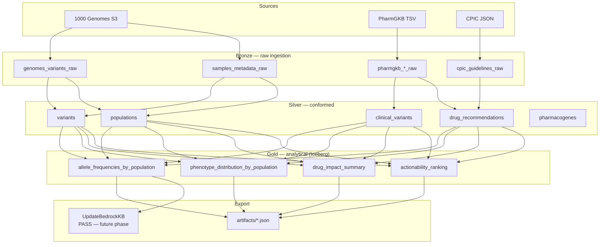

# pgx-latam-atlas

> Pharmacogenomic variant frequencies and drug response divergence across Latin American populations.

[](https://github.com/enriqew/pgx-latam-atlas/actions/workflows/ci.yml)
[](LICENSE)
[](https://www.python.org/downloads/)

## TL;DR

This project quantifies how pharmacogenomic allele frequencies differ between Latin American
populations (MXL, PEL, CLM, PUR) and European reference cohorts (CEU) using the 1000 Genomes
Project Phase 3 dataset, cross-referenced with PharmGKB clinical annotations and CPIC prescribing
guidelines. The result is a set of actionability rankings that highlight which drug–gene pairs
carry the greatest clinical divergence for Latin American patients — data currently absent from
most mainstream prescribing guidance.

## Key findings

> Pipeline run: 2026-06-01 · 40,121 variant sites across 26 populations (all 1000G Phase 3) · 10 pharmacogenes · 1,043,146 site–cohort frequency rows.
> Full data: [`artifacts/actionability_ranking.json`](artifacts/actionability_ranking.json)

### CYP2C19 — Normal Metabolizer enrichment in LATAM cohorts

LATAM cohorts carry a higher proportion of CYP2C19 Normal Metabolizers than the European
baseline, which inverts the clinical risk profile depending on the drug:

| Population | Normal Metabolizer | Intermediate Metabolizer | Poor Metabolizer |
|---|---|---|---|
| CEU (baseline) | 58.6% | 38.4% | 3.0% |
| MXL | 79.7% | 17.2% | 3.1% |
| CLM | 75.5% | 23.4% | 1.1% |
| PUR | 67.3% | 29.8% | 2.9% |
| PEL | **91.8%** | 8.2% | — |

For **clopidogrel**: IM/PM are the at-risk group (reduced conversion to active metabolite → therapeutic failure). MXL has only 20.3% IM+PM vs 41.4% in CEU — roughly half the guideline-flagged population. Standard CPIC clopidogrel alerts are over-inclusive for MXL.

For **amitriptyline and SSRIs** (CYP2C19 Normal Metabolizers require dose adjustment): the picture reverses. PEL reaches 91.8% affected (+50.4 pp vs CEU 41.4%), MXL 79.7% (+38.3 pp). The majority of Peruvian patients prescribed amitriptyline at standard CEU-derived doses are undertreated.

### SLCO1B1 — Allele frequency divergence and statin safety

SLCO1B1 variants associated with reduced hepatic uptake show the largest allele frequency
divergence in PEL relative to CEU (up to ±25 pp). Key variants on chr12:

| Variant | PEL freq | CEU freq | Δ | Direction |
|---|---|---|---|---|
| chr12:21326756 T>G | 62.4% | 87.4% | −25.0 pp | PEL lower |
| chr12:21331599 T>C | 43.5% | 68.2% | −24.7 pp | PEL lower |
| chr12:21297550 A>G | 91.2% | 66.7% | +24.5 pp | PEL higher |
| chr12:21321507 G>T | 24.7% | 1.0% | +23.7 pp | PEL higher |

CLM and MXL show moderate divergence; PUR sits closer to the CEU baseline.
Statin safety implications (simvastatin-induced myopathy risk) require haplotype-level
resolution of these variants into SLCO1B1 star alleles, which is planned for a future pipeline phase.

### Top 5 drug–gene pairs by clinical divergence vs European baseline

Ranked by percentage-point difference in individuals requiring dose or therapy change
(CPIC A/B-level guidelines, all cohorts combined):

| Rank | Drug | Gene | Population | Δ vs CEU | Affected |
|---|---|---|---|---|---|
| 1 | amitriptyline | CYP2C19 | PEL | **+50.4 pp** | 91.8% |
| 2 | amitriptyline | CYP2C19 | MXL | +38.3 pp | 79.7% |
| 3 | fluorouracil | DPYD | PEL | +46.0 pp | 47.1% |
| 4 | amitriptyline | CYP2C19 | CLM | +34.1 pp | 75.5% |
| 5 | capecitabine | DPYD | PEL | +46.0 pp | 47.1% |

**Notable DPYD finding**: PEL has 23.5% DPYD Poor Metabolizers vs 1.0% in CEU (+22.5 pp).
DPYD PM individuals face severe fluorouracil/capecitabine toxicity (myelosuppression,
mucositis). At CEU-calibrated doses, nearly 1 in 4 Peruvian patients would be significantly overdosed.

## Architecture



See [`docs/architecture.md`](docs/architecture.md) for the full medallion + Step Functions design.

## Data sources

| Source | URL | License | Refresh cadence |
|--------|-----|---------|-----------------|
| 1000 Genomes Project Phase 3 | `s3://1000genomes/` (AWS Open Data) | [Data Use Policy](https://www.internationalgenome.org/data) | Static (Phase 3 final) |
| PharmGKB | [pharmgkb.org/downloads](https://www.pharmgkb.org/downloads) | [CC BY 4.0](https://creativecommons.org/licenses/by/4.0/) | Quarterly |
| CPIC Guidelines | [cpicpgx.org](https://cpicpgx.org/guidelines/) | [CC BY 4.0](https://creativecommons.org/licenses/by/4.0/) | Per guideline update |

## Running locally

### Prerequisites

- Python 3.11+
- [`uv`](https://github.com/astral-sh/uv) (recommended) or pip
- Java 11+ (for PySpark in Phase 2)
- AWS CLI configured with profile `pgx-latam-dev` (Phase 4+)

### Setup

```bash
# Clone and install
git clone https://github.com/enriqew/pgx-latam-atlas.git
cd pgx-latam-atlas
uv pip install -e ".[dev,spark]"
pre-commit install

# Configure environment
cp .env.example .env
# Edit .env with your values

# Run full local pipeline (Phase 1–3, no AWS required)
make dry-run
```

### Make targets

```
make install        Install runtime dependencies
make install-dev    Install all dependencies + pre-commit hooks
make lint           Run ruff linter
make fmt            Run ruff formatter
make typecheck      Run mypy strict checks
make test           Run unit tests (excludes smoke + integration)
make test-smoke     Run smoke tests (hits real external URLs)
make ingest-local   Ingest raw data into data/bronze/
make transform-local Build silver tables locally
make export-local   Build gold + export artifacts/ JSONs
make dry-run        Full local pipeline end-to-end
make tf-plan        Show Terraform plan (no apply)
```

**Estimated AWS cost for a full pipeline run:** ~$2–5 USD (Glue DPU-hours + Athena scanned bytes).
Athena costs are minimized by Iceberg partition pruning on `gene_symbol` and `population_code`.

## Caveats

- **Sample sizes**: MXL n=64, PEL n=85, CLM n=94, PUR n=104. All confidence intervals use Wilson score.
- **CYP2D6 out of scope**: CNV complexity and star-allele calling require Aldy/PyPGx — excluded explicitly. See [`src/pgx_latam/utils/star_allele_scope.py`](src/pgx_latam/utils/star_allele_scope.py).
- **Common-variant focus**: MAF > 1% filter applied. Rare variants require larger cohorts for reliable frequency estimates.
- **"Latino" is not homogeneous**: MXL (Mexican ancestry in Los Angeles), PEL (Peruvians in Lima), CLM (Colombians in Medellín), PUR (Puerto Ricans in Puerto Rico) are reported separately throughout. They are never pooled into a single "Latino" category.
- **Diplotype inference**: This pipeline counts allele frequencies; it does not call diplotypes or phenotypes for multi-variant genes (e.g., CYP2C19 \*2 + \*17 compound heterozygotes require phased haplotypes).

## License

Code is MIT licensed. Data sources must be cited per their own terms:
- 1000 Genomes: cite the Phase 3 paper (PMID 26432245).
- PharmGKB: cite PharmGKB per [pharmgkb.org/page/citingPharmGKB](https://www.pharmgkb.org/page/citingPharmGKB).
- CPIC: cite per [cpicpgx.org/guidelines/](https://cpicpgx.org/guidelines/).
