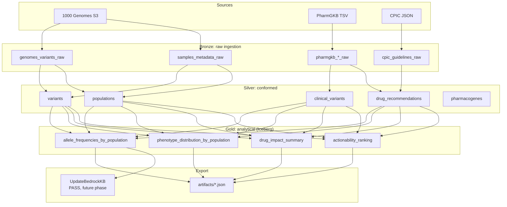

# pgx-latam-atlas

**Live demo:** [eredonda.com/projects/pgx-latam-atlas](https://eredonda.com/projects/pgx-latam-atlas?utm_source=github&utm_medium=referral)

> Pharmacogenomic allele frequencies and drug response divergence across all 26 populations of the 1000 Genomes Project Phase 3.

[](https://github.com/enriqew/pgx-latam-atlas/actions/workflows/ci.yml)
[](LICENSE)
[](https://www.python.org/downloads/)

## TL;DR

This project measures how pharmacogenomic allele frequencies and their derived metabolizer
phenotypes differ across all 26 populations of 1000 Genomes Phase 3, cross-referenced with
PharmGKB clinical annotations and CPIC prescribing guidelines. The output is an actionability
ranking: which drug–gene pairs diverge most from the Northern European cohort (CEU) that most
prescribing guidance was calibrated on.

The repo name comes from where the project started, which was a question about Latin America.
The LATAM cohorts are still the deepest section below, but reading them against the full global
panel instead of against Europe alone is what gives their numbers weight. PEL turns out to be the
most extreme CYP2C19 cohort in the entire panel, and the African and South Asian cohorts carry
divergences that a Europe versus Latin America comparison never surfaces at all.

## Key findings

> Pipeline run 2026-06-01 · 40,121 variant sites × 26 populations = 1,043,146 site–cohort
> frequency rows · 11 pharmacogenes · 2,504 individuals.
> Full data: [`artifacts/actionability_ranking.json`](artifacts/actionability_ranking.json)

### Top drug–gene pairs by divergence from the European baseline

Scored as `|Δ vs CEU| × guideline strength × share of the population affected`, over CPIC A and
B level guidelines, with one guaranteed slot per gene so no pharmacogene drops off the list:

| Rank | Drug | Gene | Population | Δ vs CEU | Affected |
|---|---|---|---|---|---|
| 1 | peginterferon alfa-2b | IFNL3 | GWD (Gambian, AFR) | +64.2 pp | 74.3% |
| 2 | peginterferon alfa-2a | IFNL3 | GWD (Gambian, AFR) | +64.2 pp | 74.3% |
| 3 | warfarin | VKORC1+CYP2C9 | STU (Sri Lankan Tamil, SAS) | +61.4 pp | 75.5% |
| 4 | amitriptyline | CYP2C19 | PEL (Peruvian, AMR) | +50.4 pp | 91.8% |
| 5 | warfarin | VKORC1+CYP2C9 | ITU (Indian Telugu, SAS) | +59.4 pp | 73.5% |

PEL outranks ITU on a smaller delta because the score multiplies by how much of the cohort is
actually affected: 91.8% of Peruvian individuals against 73.5% of Indian Telugu individuals.
The three cohorts above PEL are exactly the ones a Latin America versus Europe framing cannot see.

### CYP2C19: the widest phenotype spread in the panel

CYP2C19 Normal Metabolizer frequency runs from 50.0% to 91.8% across the 26 cohorts. The extremes
are not European:

| Population | Superpop | n | Normal | Intermediate | Poor |
|---|---|---|---|---|---|
| PEL | AMR | 85 | **91.8%** | 8.2% | 0.0% |
| CHS | EAS | 105 | 88.6% | 11.4% | 0.0% |
| KHV | EAS | 99 | 87.9% | 12.1% | 0.0% |
| MXL | AMR | 64 | 79.7% | 17.2% | 3.1% |
| CLM | AMR | 94 | 75.5% | 23.4% | 1.1% |
| PUR | AMR | 104 | 67.3% | 29.8% | 2.9% |
| CEU (baseline) | EUR | 99 | 58.6% | 38.4% | 3.0% |
| YRI | AFR | 108 | 58.3% | 34.3% | 7.4% |
| ACB | AFR | 96 | **50.0%** | 44.8% | 5.2% |

The clinical reading flips depending on the drug.

For **clopidogrel**, Intermediate and Poor Metabolizers are the at-risk group (reduced conversion
to the active metabolite, so therapeutic failure). MXL has 20.3% IM+PM against 41.4% in CEU,
roughly half the guideline-flagged population. Standard CPIC clopidogrel alerts are over-inclusive
for MXL.

For **amitriptyline and the SSRIs**, where Normal Metabolizers are the ones requiring dose
adjustment, the picture reverses. PEL reaches 91.8% affected (+50.4 pp over CEU's 41.4%) and MXL
79.7% (+38.3 pp). Most Peruvian patients prescribed amitriptyline at standard CEU-derived doses
are undertreated. The East Asian cohorts sit immediately behind PEL, which is the part that only
shows up once the full panel is in the table.

### DPYD: a fluoropyrimidine safety signal concentrated in one cohort

PEL carries 23.5% DPYD Poor Metabolizers against 1.0% in CEU. The next highest cohort in the whole
panel is CHS at 11.4%, so PEL is double anything else and more than twenty times the European
baseline. DPYD PM individuals face severe fluorouracil and capecitabine toxicity
(myelosuppression, mucositis). At CEU-calibrated doses, close to 1 in 4 Peruvian patients would be
significantly overdosed.

### SLCO1B1: allele frequency divergence and statin safety

Largest PEL versus CEU divergences among the SLCO1B1 variants published in
`allele_frequencies.json` (chr12, GRCh37):

| Variant | PEL freq | CEU freq | Δ | Direction |
|---|---|---|---|---|
| chr12:21331599 T>C | 43.5% | 68.2% | −24.7 pp | PEL lower |
| chr12:21357731 C>T | 40.0% | 16.7% | +23.3 pp | PEL higher |
| chr12:21353911 C>G | 40.0% | 16.7% | +23.3 pp | PEL higher |
| chr12:21369883 C>G | 25.3% | 5.6% | +19.7 pp | PEL higher |
| chr12:21343229 C>G | 40.6% | 21.2% | +19.4 pp | PEL higher |

Statin safety implications (simvastatin-induced myopathy risk) require haplotype-level resolution
of these variants into SLCO1B1 star alleles, which is planned for a future pipeline phase.

## Architecture



See [`docs/architecture.md`](docs/architecture.md) for the full medallion + Step Functions design.

## Data sources

| Source | URL | License | Refresh cadence |
|--------|-----|---------|-----------------|
| 1000 Genomes Project Phase 3 | `s3://1000genomes/` (AWS Open Data) | [Data Use Policy](https://www.internationalgenome.org/data) | Static (Phase 3 final) |
| PharmGKB | [pharmgkb.org/downloads](https://www.pharmgkb.org/downloads) | [CC BY-SA 4.0](https://creativecommons.org/licenses/by-sa/4.0/) | Quarterly |
| CPIC Guidelines | [cpicpgx.org](https://cpicpgx.org/guidelines/) | [CC BY 4.0](https://creativecommons.org/licenses/by/4.0/) | Per guideline update |

## Artifacts

The `artifacts/` directory holds the Gold layer exports consumed by the portfolio dashboard:

| File | Contents |
|---|---|
| `metadata.json` | Run metadata, source versions, and the 26 population definitions |
| `phenotype_distribution.json` | Phenotype frequencies per gene and population, with Wilson CIs |
| `drug_impact_summary.json` | Share of each cohort requiring a dose or therapy change, per drug |
| `actionability_ranking.json` | The scored ranking above |
| `schema_version.json` | Bumped on any breaking schema change; read it before parsing |

`allele_frequencies.json` is deliberately not committed. The full table is ~85 MB, which is past
what belongs in a git repo, so it lives in S3 and the export Lambda commits a top-40-per-gene
subset (440 variants × 26 populations) for the dashboard to fetch at runtime.

## Running locally

### Prerequisites

- Python 3.11+
- [`uv`](https://github.com/astral-sh/uv) (recommended) or pip
- Java 11+ (for PySpark in Phase 2)
- AWS CLI configured with profile `pgx-latam-dev` (Phase 4+)

### Setup

```bash
# Clone and install
git clone https://github.com/enriqew/pgx-latam-atlas.git
cd pgx-latam-atlas
uv pip install -e ".[dev,spark]"
pre-commit install

# Configure environment
cp .env.example .env
# Edit .env with your values

# Run full local pipeline (Phase 1–3: no AWS required)
make dry-run
```

### Make targets

```
make install        Install runtime dependencies
make install-dev    Install all dependencies + pre-commit hooks
make lint           Run ruff linter
make fmt            Run ruff formatter
make typecheck      Run mypy strict checks
make test           Run unit tests (excludes smoke + integration)
make test-smoke     Run smoke tests (hits real external URLs)
make ingest-local   Ingest raw data into data/bronze/
make transform-local Build silver tables locally
make export-local   Build gold + export artifacts/ JSONs
make dry-run        Full local pipeline end-to-end
make tf-plan        Show Terraform plan (no apply)
```

**Estimated AWS cost for a full pipeline run:** ~$2–5 USD (Glue DPU-hours + Athena scanned bytes).
Athena costs are minimized by Iceberg partition pruning on `gene_symbol` and `population_code`.

## Caveats

- **Sample sizes**: cohorts run from n=61 (ASW) to n=113 (GWD), 2,504 individuals in total. Every
  percentage is reported with a Wilson score confidence interval, and the narrow cohorts deserve
  the wider interval they get.
- **CYP2D6 out of scope**: CNV complexity and star-allele calling need Aldy or PyPGx, so CYP2D6 is
  excluded here explicitly. See
  [`src/pgx_latam/utils/star_allele_scope.py`](src/pgx_latam/utils/star_allele_scope.py).
- **Common-variant focus**: a MAF > 1% filter is applied. Rare variants need larger cohorts for
  reliable frequency estimates.
- **Cohorts are not populations**: MXL is Mexican ancestry sampled in Los Angeles, PEL is
  Peruvians in Lima, GWD is Gambians in the Western Division, CHS is Southern Han Chinese. They are
  reported separately throughout and never pooled into continental buckets like "Latino" or
  "African", which would erase exactly the spread this project is measuring.
- **Diplotype inference**: this pipeline counts allele frequencies and maps them to phenotypes. It
  does not call diplotypes for multi-variant genes (CYP2C19 \*2 + \*17 compound heterozygotes need
  phased haplotypes).

## License

Code is MIT licensed. Data sources must be cited per their own terms:
- 1000 Genomes: cite the Phase 3 paper (PMID 26432245).
- PharmGKB: cite PharmGKB per [pharmgkb.org/page/citingPharmGKB](https://www.pharmgkb.org/page/citingPharmGKB).
- CPIC: cite per [cpicpgx.org/guidelines/](https://cpicpgx.org/guidelines/).
